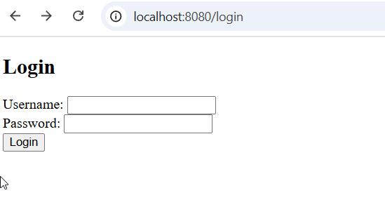
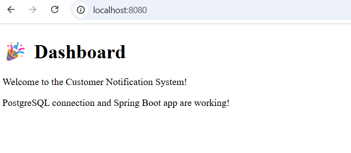
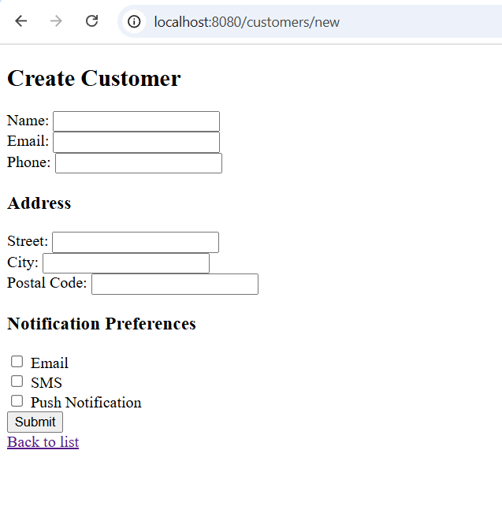
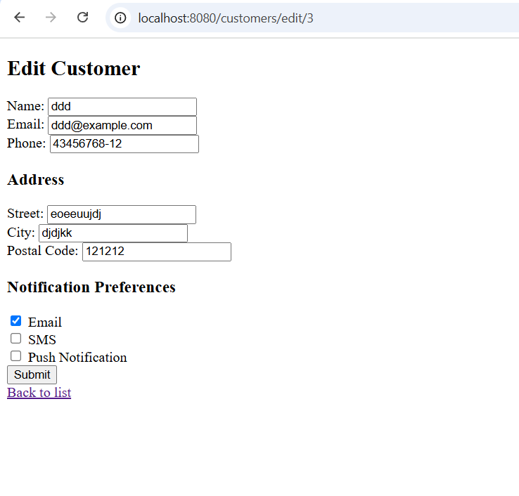
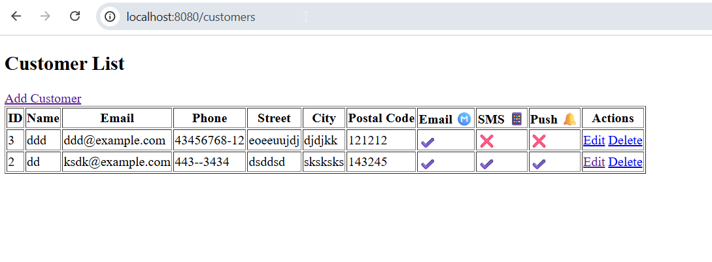

````markdown
#  Notification System

A Spring Boot application built as part of a Java internship. It allows **admin users** to manage **customers**, their **addresses**, and **notification preferences** (Email, SMS, Push).

---

##  Tech Stack

- Java 17
- Spring Boot 3
- Spring Security (admin login)
- Spring Data JPA (Hibernate)
- PostgreSQL
- Thymeleaf
- Lombok
- Maven

---

##  Features

-  Secure admin login with bcrypt
-  Full customer CRUD
-  1:1 embedded address form
-  Notification preferences (Email, SMS, Push)
-  Facade pattern for business logic encapsulation
- ️ Server-side validation and error messages
-  PostgreSQL persistence
-  Thymeleaf UI templates

---

## 🔍 UI Preview

### 🔐 Login Page


### 🏠 Dashboard


### ➕ Create Customer


### ✏️ Edit Customer


### 📋 Customer List


---

## ⚙️ Setup Instructions

### 1️⃣ Clone the Repository

```bash
git clone https://github.com/python1911/notificationsystem.git
cd notificationsystem
````

### 2️⃣ Set Up PostgreSQL

- Create a PostgreSQL database named `notification_db`.

- Update your database credentials in `src/main/resources/application.properties`:


```properties
spring.datasource.url=jdbc:postgresql://localhost:5432/notification_db
spring.datasource.username=postgres
spring.datasource.password=your-password
spring.jpa.hibernate.ddl-auto=update
```

### 3️⃣ Insert Admin Credentials

Using `psql` or pgAdmin:

```sql
INSERT INTO users (username, password, role, enabled) VALUES (
  'admin',
  '$2a$10$p81l4m2ZpmBa5BTOLakn7.e8DS.Pgkye27u9qRHEWHUf716Enj.jq', -- password: admin123
  'ADMIN',
  true
);
```

### 4️⃣ Run the Application

Use IntelliJ or the command line:

```bash
./mvnw spring-boot:run
```

---

##  Admin Login

- **Username:** `admin`

- **Password:** `admin123`


---

## Project Structure

```
notificationsystem/
├── controller/                # MVC controllers
├── entity/                    # JPA entity models
├── facade/                    # Business logic layer (Facade Pattern)
├── repository/                # Spring Data interfaces
├── config/                    # Spring Security configuration
├── templates/                 # Thymeleaf HTML templates
└── NotificationsystemApplication.java   # Main entry point
```

---

##  Design Highlights

- `@Builder`, `@Valid`, and `@Transactional` annotations used where appropriate

- `Address` entity embedded using `@OneToOne` relationship

- `NotificationPreference` entity stores SMS/Email/Push flags

- `CustomerManagementFacade` cleanly separates controller and repository logic

- Spring Security restricts access to authenticated users only

- Thymeleaf forms include validation messages and error handling


